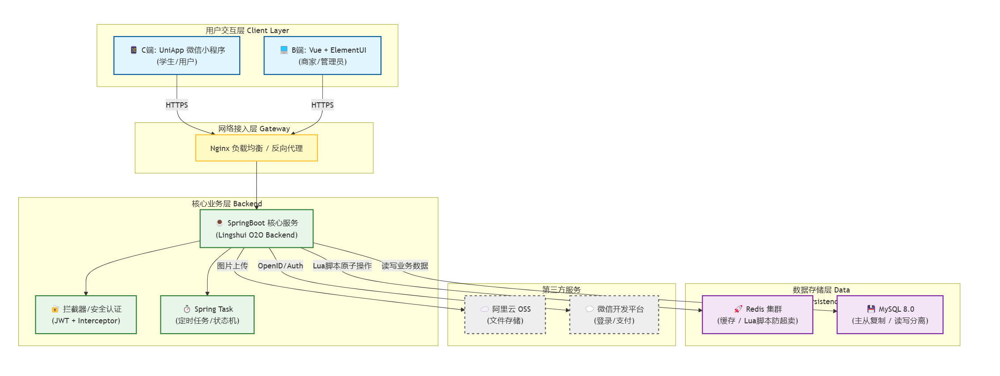
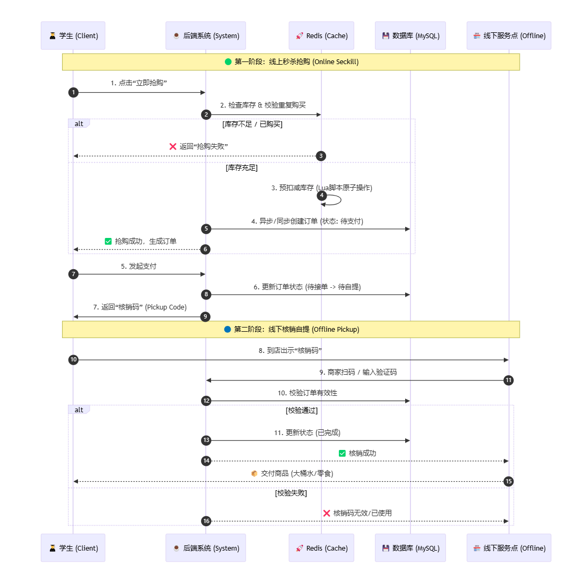
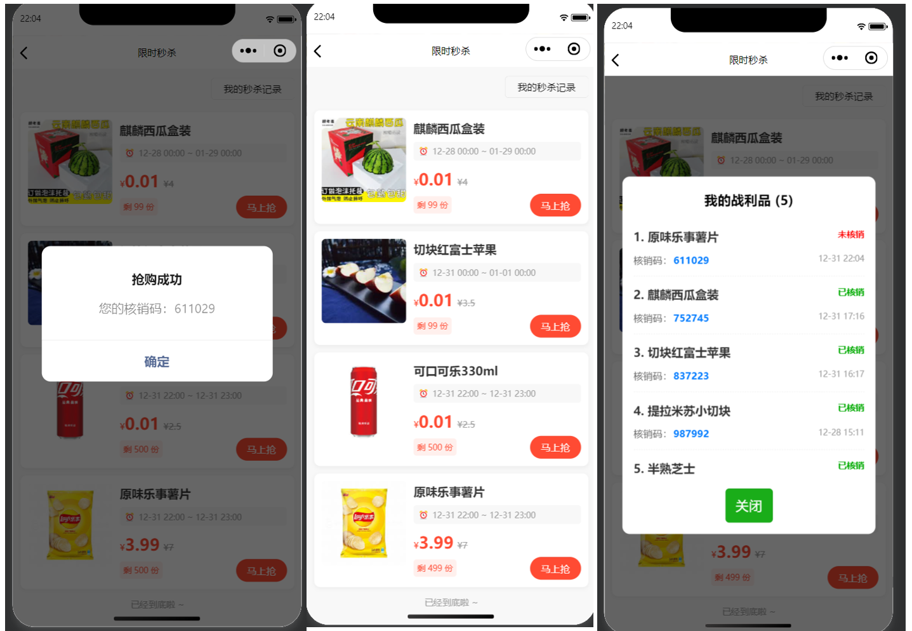
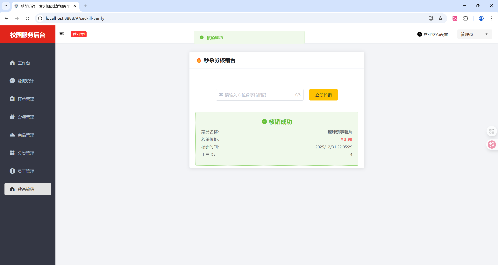

# 🎓 凌水校园生活服务平台 (Lingshui Campus O2O Platform)

> **一个基于 SpringBoot + Vue + UniApp 的高校综合 O2O 生活服务系统**
>
> 核心业务：**常态化食堂外卖配送** (基础服务) + **爆品限时秒杀** (高并发 O2O)

<p align="left">
  
  
  
  
  
  
</p>

---

## 🏗️ 系统架构 (System Architecture)

采用微服务分层设计思想，实现从移动端到后端的完整链路闭环。


---

## 🔄 核心 O2O 业务流转 (Business Flow)

真实还原校园高频消费场景，实现从**线上秒杀抢购**到**线下扫码核销**的完整闭环。


---

## 📸 功能截图 (Screenshots)

### 1. C端秒杀与核销 (Mobile Preview)


### 2. 管理端核销 (Admin Voucher)


---

## 📖 项目背景 (Background)

针对高校封闭场景下的高频消费需求，设计并实现了一套**前后端分离的 O2O（Online To Offline）生活服务平台**。

系统解决了传统校园服务中的两大痛点：
1.  **用餐高峰期拥堵**：通过**外卖配送模块**，实现食堂订单的线上化流转与配送调度。
2.  **促销商品抢购难**：针对大桶水、网红零食等热销品，设计了**秒杀+自提模块**，通过削峰填谷技术解决高并发抢购压力，并采用“线下核销码”完成 O2O 闭环。

---

## 🌟 核心亮点 (Key Features)

### 1. 高并发秒杀系统 (Flash Sale) 🔥
* **O2O 自提闭环**：设计“线上下单 -> Redis 预扣库存 -> 异步生成订单 -> 线下扫码核销”的完整流程。
* **原子性防超卖**：自定义 **Lua 脚本** 操作 Redis，在单次网络请求中完成库存校验与扣减，彻底解决并发超卖问题。
* **异步削峰填谷**：引入 **RabbitMQ** 消息队列，将瞬间高并发的抢购请求异步化处理，保护数据库不被击垮。

### 2. 多级缓存防护体系 (Cache Protection)
* **防缓存穿透**：针对查询为空的数据，在 Redis 中缓存空对象（TTL 2分钟），防止恶意请求直接击穿数据库。
* **防缓存雪崩**：在缓存数据时采用 **Base Time + Random Time**（随机过期时间）策略，避免大量缓存同时失效导致数据库压力骤增。
* **数据一致性**：采用 Cache Aside 模式，更新数据时主动删除缓存，读取时自动回填。

### 3. 复杂订单状态机 (Order State Machine)
* 实现了完整的订单生命周期管理：`待支付` -> `待接单` -> `配送中` -> `已完成` / `退款处理`。
* 利用 **Spring Task** 定时任务处理超时未支付订单（15分钟自动取消）及每日状态检查。

---

## 📂 项目结构 (Directory Structure)

本项目采用 Monorepo 模式管理，包含以下核心模块：

```text
lingshui-o2o-project/
├── backend/            # Java 后端工程 (SpringBoot + RabbitMQ)
│   ├── src/main/java/com/sky/  # 核心业务代码
│   └── ...
│
├── frontend-admin/     # 商家管理后台 (Vue + TypeScript)
│   └── src/views/      # 页面逻辑
│
├── frontend-mp/        # C端微信小程序 (UniApp)
│   └── pages/          # 小程序页面
│
└── sql/                # 数据库初始化脚本
```

---

## 🚀 快速开始 (Quick Start)

### 环境要求
* JDK 1.8+
* MySQL 8.0
* Redis
* Node.js

### 启动步骤
1.  **导入数据库**：执行 `sql/` 目录下的脚本文件。
2.  **启动后端**：IDEA 打开 `backend` 目录，配置 `application.yml` 中的数据库/Redis 连接，运行主启动类。
3.  **启动管理端**：进入 `frontend-admin`，执行 `npm install` && `npm run serve`。
4.  **启动小程序**：使用 HBuilderX 打开 `frontend-mp`，运行至微信开发者工具。

---

> **Note**: 本项目仅供学习交流。